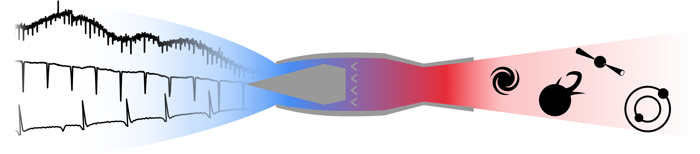

# qusi (formerly RAMjET)

`qusi` is a framework for producing neural networks to characterize phenomena in astrophysical photometric data.

[See here for documentation.](https://qusi.readthedocs.io/en/latest/)
