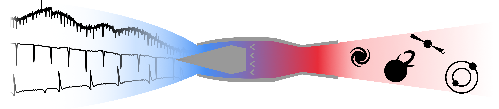

RAMjET RApid MachinE-learned Triage
====================================

**RAMjET is currently under development. This documentation is currently oriented toward the RAMjET development team.**

RAMjET is a framework for producing neural networks to characterize phenomena in astrophysical photometric data.

To produce a network which can produce good predictions two main components need to be handled. First, the data for
training and testing the network needs to be prepared. Second, the network architecture along with an appropriate
training system needs to be designed.

We are interested in two main forms of input data: lightcurve data and raw flux pixel data. Lightcurves provide a
simple, largely human interpretable form of input data. These lightcurves have been produced through some process from
original flux pixel data. Often, the transformation process from flux pixel data to lightcurves discards valuable
information, because the hope is to produce a human understandable lightcurve. Because of this, allowing the network
to work with the more raw pixel flux data will allow the network to utilize more subtle and complex patterns discarded
by the lightcurve production process. Throughout the rest of the documentation, we will often refer to a lightcurve or
a series of flux frames as an "example". This is because the neural network will use lightcurve or a series of flux
frames as its input.

We are interested in several types of data characterizations (labels). These labels are the information we want the
network to be able to automatically predict. For example, we may wish to know whether a lightcurve contains a transit or
microlensing event. Each of these would be a binary type label for each lightcurve. For the moment, RAMjET is focused on
two types of output predictions, each of which can be applied to many problems. The first is a single binary label per
example. That is, the entire input example (e.g., the entire lightcurve) has a single yes/no label, specifying if that
example contains an instance of the phenomena we're looking for. The second type of label we're currently focused on
is a binary label per time step. That is, each time step of the input example has a corresponding binary label. For
instance, a lightcurve may have each time step labeled as to whether a transit event is occurring during that time step.
While it's more effort to produce this kind of label for use in training the network, it means the network will also
produce this more meaningful label in its predictions, and, furthermore, it can make the training process easier as
well.

.. toctree::

    input_data_types
    autoapi/index