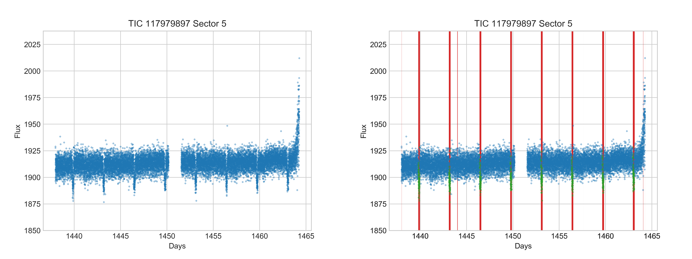

Quick start tutorial
====================

Tutorial Summary
----------------
This tutorial will get you started using the RAMjET pipeline to train a neural network to detect exoplanet transit
events in `TESS <https://tess.mit.edu>`_ data. You will end up with a trained neural network that can be applied to TESS
lightcurves to predict where transits exist in the lightcurve (if they exist at all). For example, one of the below
images show an original lightcurve from TESS, and the other shows the true transit locations (in green) as well as what the
trained neural network predicted (in red). You will be able to produce results similar to this. This tutorial is only intended
to get the code working for you for a specific use case. It will *not* teach you how the process works nor how to make
it work for another use case.

Install
-------
First, you need Python 3.6+ with :code:`pip` installed. Ideally, this Python install is in its own Python virtual
environment or Conda environment to make sure this project doesn't interfere with other projects and vice versa. The
rest of this tutorial assumes the command :code:`python` will run your Python 3 install (on some systems this will
run Python 2 by default). The same is true for :code:`pip` running the Python 3 related version of :code:`pip`.

Next, clone down the RAMjET repository and change directory to that repository:

.. code-block:: bash

    git clone https://github.com/golmschenk/ramjet.git
    cd ramjet

Then, you'll need to install all the required Python packages:

.. code-block:: bash

    pip install -r requirements.txt

After this, **only if you will be using a GPU** replace the installed TensorFlow package with the GPU version:

.. code-block:: bash

    pip install tensorflow-gpu

This installation assumes you already have your GPU properly setup and installed, and the GPU is compatible with
TensorFlow. Note that without a GPU, the training code will take significantly longer to run.

Download the data
-----------------
Next up, we need to get the TESS data to use for training and evaluation. To do this, from the :code:`ramjet` directory,
run:

.. code-block:: bash

    python -m ramjet.photometric_database.toi_lightcurve_database

This download will take a while and will download ~20GB of data.

Train the network
-----------------
To train the network, run the following command:

.. code-block:: bash

    python train.py

If you run out of memory, reducing the batch size in :code:`train.py` may help.

Training metrics will be printed to the terminal as the network learns. To see the live training progress in plot form,
open a second terminal in the :code:`ramjet` directory and run:

.. code-block:: bash

    tensorboard --logdir=logs

This will start a local web server which displays the training progress in plot form. With this running, the plots
can be viewed by opening a web browser to :code:`http://localhost:6006`.

When the training finishes, or if you end it early with something like :code:`control + c`, the trained network will
be saved to the log directory.

Using the trained network to make predictions
---------------------------------------------
To make a prediction for a lightcurve like shown above, run:

.. code-block:: bash

    python infer.py

This script will generate a plot of a lightcurve with the network's predictions and save the image to a file in
the current directory.

Although the network can make very predictions very quickly, this particular inference script is slowed by several
factors. In particular, the network initialization (required only once for any number of predictions) and result image
generation are relatively slow. Additionally, to keep the code simple, the data preprocessing is done synchronously
with predictions, and the network processes a single lightcurve at a time. Asynchronous data preprocessing and
predictions on batches of lightcurves leads to significantly faster inference speeds (but less understandable code,
hence is excluded from this example script).
