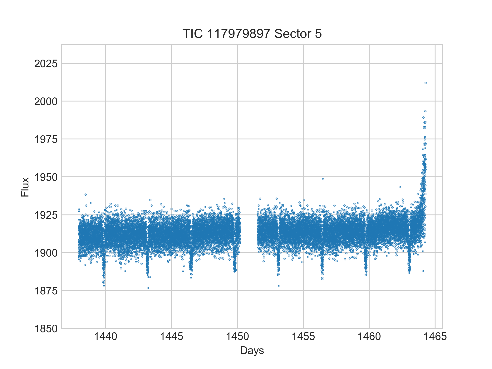

Quick start tutorial
====================

Tutorial Summary
----------------
This tutorial will get you started using the RAMjET pipeline to train a neural network to detect exoplanet transit
events in `TESS <https://tess.mit.edu>`_ data. You will end up with a trained neural network that can be applied to TESS
lightcurves to predict if a transit exists in the given lightcurves. This tutorial is only intended
to get the code working for you for a specific use case. It will *not* teach you how the process works nor how to make
it work for another use case.

Install
-------
First, you need Python 3.6+ with :code:`pip` installed. Ideally, this Python install is in its own Python virtual
environment or Conda environment to make sure this project doesn't interfere with other projects and vice versa. The
rest of this tutorial assumes the command :code:`python` will run your Python 3 install (on some systems this will
run Python 2 by default). The same is true for :code:`pip` running the Python 3 related version of :code:`pip`.

Next, clone down the RAMjET repository and change directory to that repository:

.. code-block:: bash

    git clone https://github.com/golmschenk/ramjet.git
    cd ramjet

Then, you'll need to install all the required Python packages:

.. code-block:: bash

    pip install -r requirements.txt

This installation assumes you already have your GPU properly setup and installed, and the GPU is compatible with
TensorFlow (if you intend to use a GPU). Note that without a GPU, the training code will take significantly longer to
run.

Download the data
-----------------
Next up, we need to get the TESS data to use for training and evaluation. To do this, from the :code:`ramjet` directory,
run:

.. code-block:: bash

    python -m ramjet.photometric_database.toi_database

This download will take a while and will download ~25GB of data (the amount of data may change as TESS continues
producing data).

Train the network
-----------------
To train the network, run the following command:

.. code-block:: bash

    python train.py

If you run out of memory, reducing the batch size in :code:`train.py` may help.

Training metrics will be printed to the terminal as the network learns. To see the live training progress in plot form,
open a second terminal in the :code:`ramjet` directory and run:

.. code-block:: bash

    tensorboard --logdir=logs

This will start a local web server which displays the training progress in plot form. With this running, the plots
can be viewed by opening a web browser to :code:`http://localhost:6006`.

When the training finishes, or if you end it early with something like :code:`control + c`, the trained network will
be saved to the log directory.

Using the trained network to make predictions
---------------------------------------------
To use the network to make predictions over all the lightcurves, run:

.. code-block:: bash

    python infer.py

This script will load the latest trained model (from the :code:`logs` directory), and use it make a prediction about
each of the lightcurves. A number from 0 to 1 is assigned to each lightcurve which states the network's confidence that
the lightcurve contains a transit event. 0 meaning the network is confident that the lightcurve contains no transit and
1 meaning the network is confident the lightcurve contains a transit. These predictions will be saved to a file in the
same log directory where the trained model is kept. The path to this file from the root :code:`ramjet` directory will be
:code:`logs/baseline YYYY-MM-DD-hh-mm-ss/infer results YYYY-MM-DD-hh-mm-ss.feather`, where the first datetime is when
the network training was started, and the second datetime is when the inference run was started. The results will be
sorted with the most likely transit candidates at the stop of the list. A :code:`feather` file is essentially an
efficient CSV file. Unfortunately, it is not directly human readable. See the next step for viewing the results.

Viewing the predictions
-----------------------
To view the prediction results, the easiest method is to load the :code:`feather` file into a Pandas dataframe. Open a
Python console (or add this code to a Python file) in the root :code:`ramjet` project
directory:

.. code-block:: bash

    import pandas as pd
    results_data_frame = pd.load_feather(`logs/baseline YYYY-MM-DD-hh-mm-ss/infer results YYYY-MM-DD-hh-mm-ss.feather`)
    print(results_data_frame.head(10))

This code will list the top 10 results, including their paths and network prediction confidence. For more ways to
explore the Pandas data frame, see `Pandas' tutorial on data frames
<https://pandas.pydata.org/docs/getting_started/intro_tutorials/02_read_write.html#min-tut-02-read-write>`_.
If you would prefer to have a standard CSV file, you can save the data frame to a CSV using
:code:`results_data_frame.to_csv('path/to/desired/output/location.csv')`.

Finally, to directly view one of the lightcurves, :code:`ramjet` provides an quick viewing interface with something
like:

.. code-block:: python

    from ramjet.data_interface.tess_data_interface import TessDataInterface
    tess_data_interface = TessDataInterface()
    tess_data_interface.plot_lightcurve_from_mast(tic_id=117979897, sector=5)
