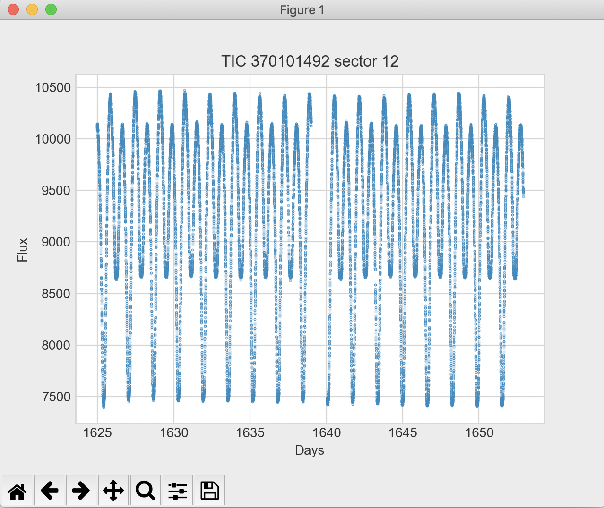

Simple TESS data interface tutorial
===================================

Tutorial Summary
----------------

This tutorial provides shows how to use several convenience functions in the :code:`ramjet` package to quickly download,
view, and find additional information about `TESS <https://tess.mit.edu>`_ lightcurves. For the time being, this is only
for 2-minute cadence TESS lightcurves.

Setup
-----
All that's needed for this tutorial is to install :code:`ramjet` pip package using:

.. code-block:: bash

    pip install astroramjet

All the functions below are methods of the `TessDataInterface` class. So we need to create an instance of this class to
use the rest of the commands. Either from a Python console, or in a Python script, create the instance object using:

.. code-block:: python

    from ramjet.photometric_database.tess_data_interface import TessDataInterface
    tess_data_interface = TessDataInterface()

Download a TESS lightcurve
--------------------------
To download a lightcurve, use a command like:

.. code-block:: python

    tess_data_interface.download_lightcurve(tic_id=370101492, sector=12, save_directory='lightcurves')

This will create a directory called "lightcurves" in the current working directory (if it doesn't exist), and download
into it the lightcurve FITS file for TIC 370101492 in sector 12.

Plot a lightcurve from MAST
---------------------------
This provides a single line to plot a lightcurve from MAST for quick viewing.

.. code-block:: python

    tess_data_interface.plot_lightcurve_from_mast(tic_id=370101492, sector=12)

This will generate an interactive Matplotlib window plotting the lightcurve.

The lightcurve is downloaded to a temporary directory, so you don't need to worry about cleanup. You can also pass
`base_data_point_size=10` to increase the point plotting size (10 can be swapped with any size). This helps when
zooming in to a view that will have much less data points.

Checking for known planets
--------------------------

Running

.. code-block:: python

    tess_data_interface.print_exofop_planet_dispositions_for_tic_target(tic_id=425997655)

will print any known `Exoplanet Follow-up Observing Program <https://exofop.ipac.caltech.edu/tess/>`_ planet
dispositions for a the passed TIC ID.

Checking for known variability
------------------------------

Running

.. code-block:: python

    tess_data_interface.print_variables_near_tess_target(tic_id=59661876)

will print any known variability near the target from the
`General Catalogue of  <http://www.sai.msu.su/gcvs/gcvs/>`_ planet
dispositions for a the passed TIC ID.

